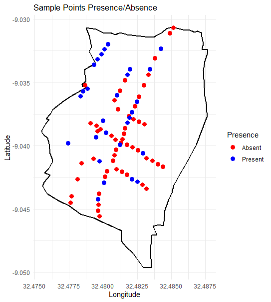
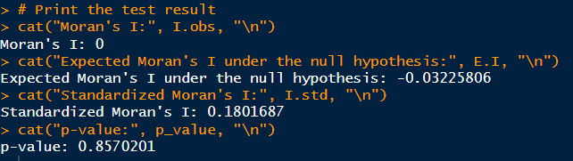

# Lateral Gene Transfer in a Tanzanian Grass Population

This internship was completed in collaboration with Dr Luke Dunning through the Sheffield Undergraduate Research Experience Scheme.

## Background

- Lateral Gene Transfer (LGT) allows organisms, such as the grass Alloteropsis semialata, to gain genetic
information beyond sexual reproduction.
- Alloteropsis semialata grass has laterally acquired genes from Cenchrinae and Melinidinae
grass subtribes, boosting phosphoenolpyruvate carboxylase (PEPC) enzymatic kinetic efficiency
during C4 photosynthesis.
- Previous studies have shown that presence of this adaptive LGT varies on
larger geographic scales.
- A key question is whether such variation is also observed in smaller
confined populations.

## Methods
- Prior to this project, A. semialata was sampled along transects in a confined forest fragment surrounded by agriculture, located in Tanzania. Data concerning other biogeographic variables (disturbance level, surrounding plant density, and canopy cover) was also collected.
- I identified whether the PEPC gene was present/absent in samples from this population using a range of wet lab techniques including: preparation of live grass samples for DNA extraction using liquid nitrogen, preparation of dried grass samples for DNA extraction using sand and a pestle and mortar, DNA extraction using Qiagen DNeasy plant mini kits, Pipetting, PCR and Gel Electrophoresis.
- For 86 individuals I mapped the distribution of gene presence/absence in R. I performed Global Moran's I in R (for an explanation of this spatial autocorrelation statistical test see: https://www.statisticshowto.com/morans-i/) to determine if PEPC gene presence was randomly distributed across our sampling transects.

## Data Analysis

## Mapping PEPC gene presence/absence

```
### Install and Load Packages

```{r setup, message=FALSE, warning=FALSE}
# Install required packages (only run once)
if (!requireNamespace("ggplot2", quietly = TRUE)) install.packages("ggplot2")
if (!requireNamespace("sf", quietly = TRUE)) install.packages("sf")
if (!requireNamespace("readr", quietly = TRUE)) install.packages("readr")

# Load necessary libraries
library(ggplot2)
library(sf)
library(readr)
```

---

### **Load Data**

```{r}
# Define file paths (ensure correct paths when running in RStudio)
perimeter_file <- "mapperimeter.csv"
samples_file <- "cenpresenceabsence.csv"

# Load datasets
perimeter <- read_csv(perimeter_file)
samples <- read_csv(samples_file)
```

---

### **Convert Data to Spatial Format**

```{r}
# Convert perimeter to sf spatial object
perimeter_sf <- st_as_sf(perimeter, coords = c("long", "lat"), crs = 4326)

# Convert sample points to sf spatial object
samples_sf <- st_as_sf(samples, coords = c("long", "lat"), crs = 4326)

# Convert perimeter_sf to a regular dataframe for geom_path
perimeter_df <- as.data.frame(st_coordinates(perimeter_sf))
colnames(perimeter_df) <- c("long", "lat")
```

---

### **Plot Sample Points with Perimeter**

```{r, echo=FALSE}
ggplot() +
  geom_path(data = perimeter_df, aes(x = long, y = lat), color = "black", size = 1) +  
  geom_point(data = samples, aes(x = long, y = lat, color = Cen_Copy), size = 3) +  
  scale_color_manual(values = c("Present" = "blue", "Absent" = "red")) +
  labs(title = "Sample Points Presence/Absence",
       x = "Longitude", y = "Latitude", color = "Presence") +
  theme_minimal()
```
### Plot



## Global Moran's I


### Read the data from the CSV file
```
data <- read.csv("cenpresenceabsence.csv")
```

### Filter the data to keep only the "Present" samples
```
present_data <- data[data$Cen_Copy == "Present", ]
```
### Create a matrix of coordinates
```
coords <- cbind(present_data$long, present_data$lat)
```

### Calculate the Euclidean distance matrix
```
dist_matrix <- as.matrix(dist(coords))
```
### Compute the Global Moran's I test manually
```
n <- nrow(present_data)  # Number of present samples
W <- 1 / dist_matrix     # Inverse of the distance matrix
W[is.infinite(W)] <- 0   # Replace infinite values with 0
X <- as.numeric(present_data$Cen_Copy == "Present")  # Convert "Present" to 1, "Absent" to 0

### Compute observed Moran's I
I.obs <- (n * sum(W * X) - sum(W) * sum(X)) / (sum(W^2) - (sum(W)^2 / n))

### Compute expected Moran's I under the null hypothesis
E.I <- -1 / (n - 1)

### Compute variance of Moran's I
var.I <- (n * (n - 1) * sum((W %*% X)^2) - 2 * sum(W * X)^2 + 2 * sum(W^2 * X^2)) / ((n - 1)^2 * sum(W)^2)

### Compute standardized Moran's I
I.std <- (I.obs - E.I) / sqrt(var.I)

### Compute p-value
p_value <- 2 * (1 - pnorm(abs(I.std)))

### Print the test result
cat("Moran's I:", I.obs, "\n")
cat("Expected Moran's I under the null hypothesis:", E.I, "\n")
cat("Standardized Moran's I:", I.std, "\n")
cat("p-value:", p_value, "\n")
```


## Results
- Cenchrinae LGT had a random distribution within the population (Standardised Global Moran’s I = 0.180, p = 0.857).
- Other biogeographic variables were unrelated to Cenchrinae LGT presence, supporting our analysis of random distribution.
