# Scorpion distribution and diversity by palaeobiome

This work is taken from my Integrated Masters dissertation, The University of Sheffield. If you would like read the full document and explore any references mentioned below, it can be viewed here: [View Dissertation](https://github.com/avb279/avb279.github.io/blob/main/Projects/2_L4Dissertation.pdf)

## 2.3 Scorpion distribution and diversity by palaeobiome
While the fossil record of most extant arthropods is skewed towards the Cenozoic (Dunlop et al.,
2008b), scorpions exhibit greater diversity in the Palaeozoic, with 81 species compared to 39
Mesozoic and 27 Cenozoic species (Viaretti et al., 2023). It remains unknown whether these
observations reflect true diversity levels. Bias may stem from the differing preservation potentials of cuticles from different arthropod groups (see 3.1), taxonomic over-splitting due to
questionable species descriptions made in Kjellesvig-Waering’s (1986) influential work, or
increased sampling bias from numerous scorpion-rich Palaeozoic localities (Jeram, 1989).

Legg et al., (2012) postulated that Palaeozoic scorpions were not diverse at all if you control for
scorpion distribution across palaeobiomes. Today scorpions are more diverse in desert (arid)
than tropical biomes (Poilis, 1990), a pattern qualitatively described in some Palaeozoic
deposits restricted by geography and age, like the Mazon Creek Lagerstatten (Legg et al.,
2012). However, further investigation is needed to ascertain whether this pattern holds true on a
global scale, across a diverse range of geological ages.

Here I aim to conduct a database search to map scorpion biogeographical distribution, from the
Silurian (~ 444 Mya) to the Holocene (~ 11,700 years ago - present day), and use this data to
assess how scorpion diversity changes in different palaeobiomes over geological time.

I hypothesise that in both the Palaeozoic, and the rest of geological time (Mesoszoic and
Cenozoic), scorpion diversity will be the highest in arid biomes.

## 2.3.1 Methods
## 2.3.1.1 Systematic review
I downloaded scorpion fossil distribution data using literature records from The Palaeobiology
Database (2023) (https://paleobiodb.org/#/).
Search terms included:
- Scorpiones taxa, collected using accepted species names only to avoid naming
confusion, and collected with only regular taxa (not form taxa or ichnotaxa) to increase
confidence in linking a single scorpion fossil to a single species.
Output data included:
- Accepted Species Name
- Abundance Value
- Geological Period (early_interval, late_interval)
- Age (Max_Ma, Min_Ma).
- Palaeogeography (Palaeolong, Palaeolat coordinates)
- A reference for each fossil entry

I then carried out a PRISMA screening process to ensure that records analysed were
appropriate for my specific hypothesis (figure 1):

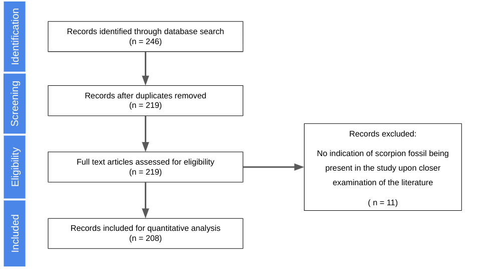

Figure 1: PRISMA flow chart detailing scorpion fossil specimen search strategy for quantitative
analysis.

I also scored record quality based on robustness and data uncertainty, following Lim et al.,
(2021). High quality records had references with micrographs of specimens for taxonomic
validation. Medium quality records were present in the literature but lacked micrographs. Low
quality records were solely found in the Palaeobiology Database and not in the literature.


Appendix 1 contains the literature sources used to compile the scorpion fossil dataset.

## 2.3.1.2 Mapping and Palaeobiome allocation
Using my dataset and R (v.4.3.2), I mapped global scorpion fossil distribution across all
geological periods (fig.2) (Moon, 2021). 

#### Example code for Silurian period is shown below:

#### install.packages
```
install.packages("./RCourse/rgdal_1.6-7.tar.gz", type = "source", repos = NULL)
```
#### Load the library
```
library(rgdal)
```
#### Load in data 

#### All Records
```
fossil_data <- read.csv("./dissertation/Silurian.csv")
```
#### High Quality Records
```
high_data <- read.csv("./dissertation/SilurianHigh.csv")
```
#### Obtain Silurian map from gplates 
#### Replace 'silurian_coastline_url' and 'silurian_polygons_url' with the actual URLs
```
silurian_coastline_url <-
"http://gws.gplates.org/reconstruct/coastlines/?time=420&model=GOLONKA"
silurian_polygons_url <-
"http://gws.gplates.org/reconstruct/static_polygons/?time=420&model=GOLONKA"
silurian_coastlines <- rgdal::readOGR(silurian_coastline_url)
silurian_polygons <- rgdal::readOGR(silurian_polygons_url)
```
#### Prepare data for plotting 
#### Tidy up the spatial data
```
silurian_coastlines <- broom::tidy(silurian_coastlines)
silurian_polygons <- broom::tidy(silurian_polygons)
```
#### Create the map 
```
silurian_map <-
ggplot() +
geom_map(
data = silurian_polygons, map = silurian_polygons,
aes(x = long, y = lat, map_id = id),
size = 0.15, fill = "#d8d8d8"
) +
geom_map(
data = silurian_coastlines, map = silurian_coastlines,
aes(x = long, y = lat, map_id = id),
size = 0.15, fill = NA, colour = "grey30"
) +
geom_rect(
data = data.frame(xmin = -180, xmax = 180, ymin = -90, ymax = 90),
aes(xmin = xmin, xmax = xmax, ymin = ymin, ymax = ymax),
color = 1, fill = NA, size = 0.3
) +
coord_map("mollweide") +
ggthemes::theme_map()
silurian_map +
labs(
title = "Palaeogeographical map of continental plate (grey) arrangement\nin the Silurian (420
Ma) with modern coastlines outlined above."
)
```
#### Plot fossil scorpion points (all records)
```
silurian_map +
geom_point(
data = fossil_data,
aes(x = paleolng, y = paleolat),
color = "red", size = 3
) 
```
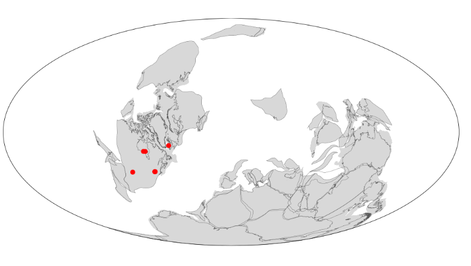

#### Plot fossil scorpion points (high quality records)
```
silurian_map +
geom_point(
data = high_data,
aes(x = paleolng, y = paleolat),
color = "blue", size = 3
) 
```
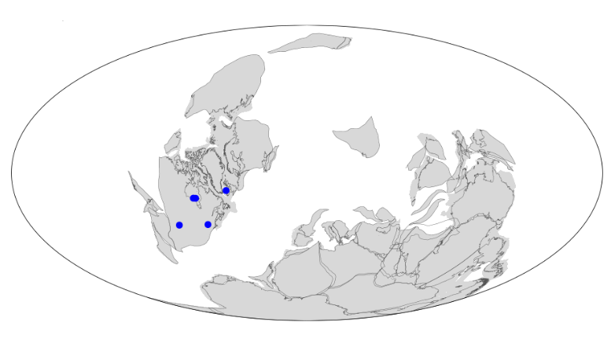

I then assigned all scorpion fossils (red) to a palaeobiome (Arid, Cool temperate, Warm temperate, or Tropical)
using the Scotese reference maps (fig.2).

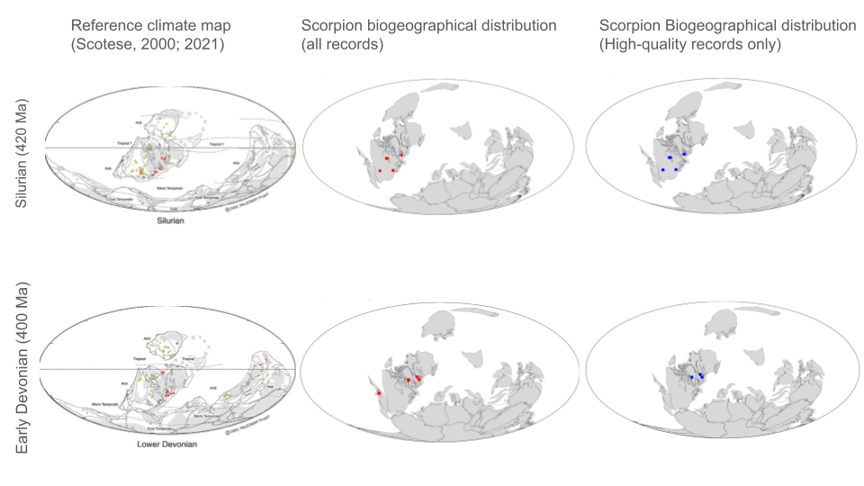
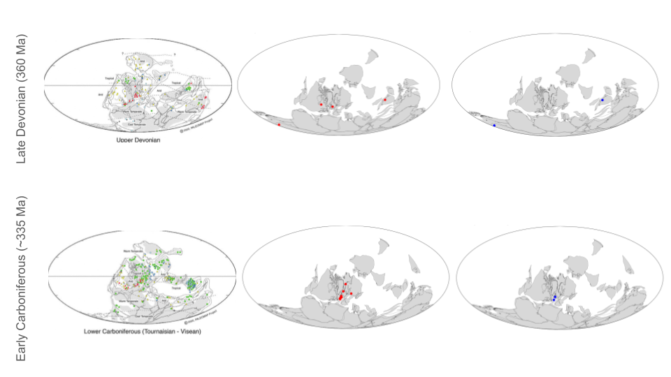
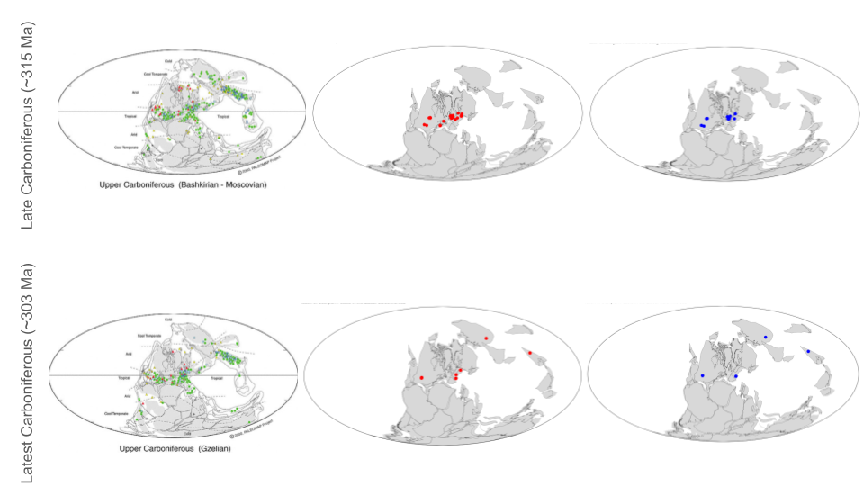
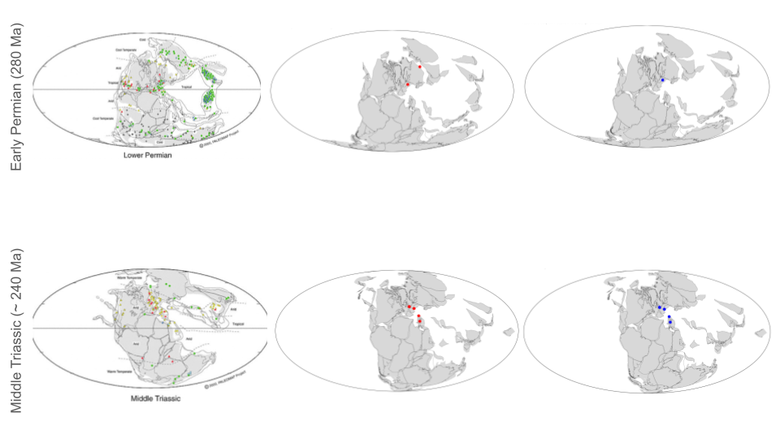
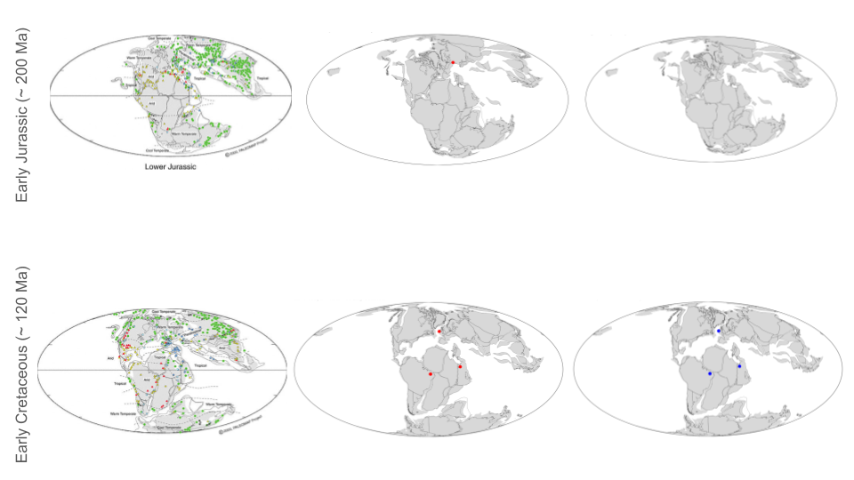
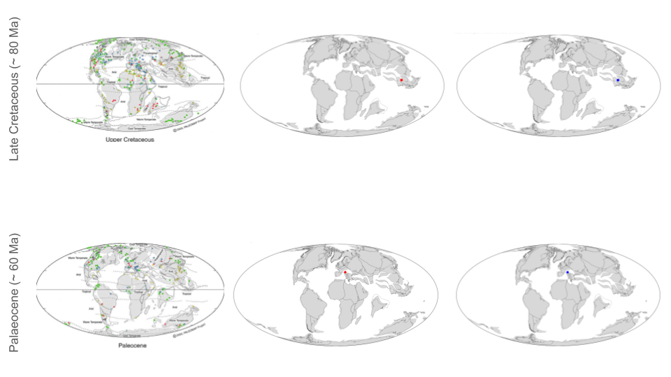
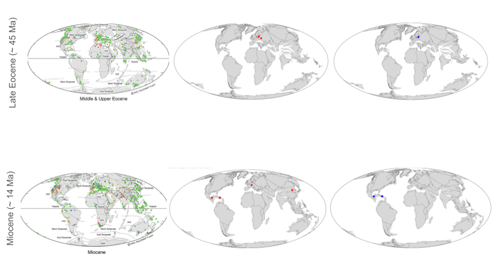
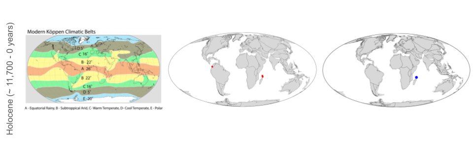

Figure 2: Scorpion fossil distribution through time. Reference palaeobiome maps (left) from Scotese (2000;2021). All fossil occurrences are mapped
in red (middle), and only high-quality records are in blue (right). Continental plates were mapped at the midpoint of each period using GPlates
(https://www.gplates.org/).

## 2.3.1.3 Quantifying scorpion diversity by palaeobiome
In R, scorpion diversity (red, fig.2) by palaeobiome was calculated for each geological period in
which scorpion fossils were identified, using the Margalef Index (d), d =(S-1)/ln(n), an indicator
of species richness count (S) that accounts for effect size and higher species richness expected
with a greater number of individuals (n) (Araia et al., 2019). Margalef Diversity Indices were
temporally standardised ((d’) = Margalef Index (d) * (Period duration/Era duration)) (Lim et al.,
2021). Standardised Margalef Indices were grouped by Palaeozoic or Other
(Mesozoic/Cenozoic) Era and Biome. The cumulative sum of the Standardised Margalef Index
was calculated for each group (Table 1; Table 2, 3.s.f).

## 2.4 Results
Tables 1 and 2 summarise the results of the analysis:
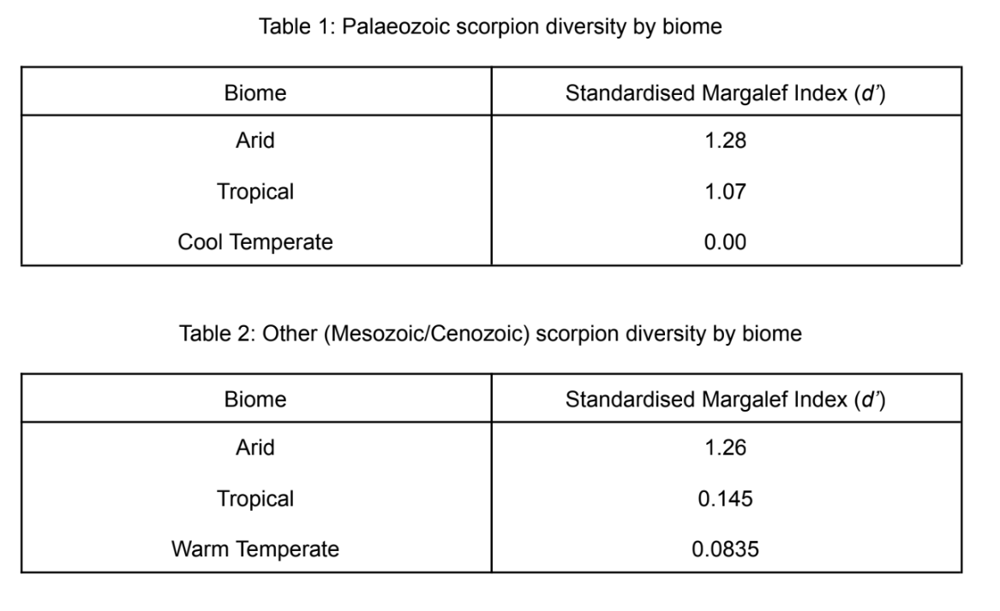

## 2.5 Discussion
My hypothesis that scorpion diversity would be higher in arid biomes in both the Palaeozoic and
Mesozoic/Cenozoic (Other) eras is correct (Table 1; Table 2). Arid biomes have the highest
Standardized Margalef Index (d’) in both Palaeozoic (1.28) and Other (1.26) geological eras.
These similar values align with Legg et al.,'s (2012) suggestion that when controlling for 
palaeobiome distribution, Palaeozoic scorpions were not diverse at all. The consistently high
diversity in arid desert biomes can be explained by two main factors.

Firstly, the harsh desert environment likely imposed strong evolutionary pressure on scorpions
over time in terms of foraging and food stress (Polis, 1988). Unpredictable desert food
availability directly impacts scorpion growth and reproduction (Bradley, 1988). Optimality theory
suggests that scorpions maximise energy acquisition in both high and low desert food
availability conditions (Polis, 1998). During low food availability, scorpions consume a broader
range of smaller prey less frequently, sometimes predating other noxious scorpions (Polis,
1980). This shift in feeding behaviour directly influences life history characteristics, potentially
providing scorpions with adaptations for long-term desert survival. When comparing multiple
desert regions with varying food availability, different species adapt to different food regimes,
contributing to increased species richness and diversity across all desert biomes as a whole
(Polis, 1998). However, some Silurian scorpions (fig.2) in semi-arid regions lived in
water-inundated environments. Here the stresses of a harsh desert terrestrial environment may
not apply, making optimality theory less relevant in explaining higher scorpion diversity
(Waddington et al., 2015).

A stronger explanation for high diversity is that specialised desert scorpions evolved in situ from
more generalist species, leading to the independent evolution of Bothriridae (South American),
Vaejovidae (North America), and Scorpionidae (originally tropical Gondwanan) families (Nenilin
and Fet, 1992; Fet et al., 1998). This in situ evolution, often in isolated coastal dunes and
riverbanks, facilitated rapid evolution through allopatric speciation, increasing overall desert
scorpion diversity (Kryzhanovsky, 1965). The initial generalist ecology of scorpions may explain
their consistent survival as 'living fossils' across various biomes over geological time, albeit with
lower diversities (Table 1: Tropical, d’ = 1.07, Cool Temperate, d’ = 0.00; Table 2: Tropical, d’ =
0.145, Warm Temperate, d’ = 0.0835). The reason for lower diversity in non-arid biomes remains
unclear. During large-scale environmental events/mass extinctions, burrowing scorpions have a
better chance of survival underground (Feng et al., 2022; Cowles, 2018). However, large
tropical vegetation changes, such as the complete destruction of equatorial tropical forests after
the Permian–Triassic ecologic crisis (fig.2, Early Permian, Middle Triassic) (Looy et al., 1999;
Pfefferkorn, 1999), or rapid shifts in vegetation structure after strong tropical summer monsoons
of the Early-Middle Holocene (fig.2, Holocene) (Ye et al., 2018), may have hindered tropical
scorpion survival, due to habitat destruction and low scorpion dispersal ability after destructive
events (Foerster et al., 2020). The connection between vegetation structure and scorpion diversity remains unexplored. Future studies should investigate both
palaeobotanical/palynological and scorpion fossil records to understand this interaction over
geological time.

Estimating scorpion biodiversity changes is limited by significant sampling effort variations
between Palaeozoic and Other aged localities (see 2.3). Rarefaction is commonly used to
standardise diversity measures to achieve equal subsample coverage, but can be misleading as
it compresses richness ratios (Close et al., 2018). The Margalef Index (d) is a stronger diversity
measure, being advantageous over rarefaction by correcting for sampling effort variation whilst
being independent of sample size (Fernandez et al., 2021). However, recent work by Kunakh et
al., (2023) suggests a high level of dependence of d on sample size, impacting its ability to
reflect meaningful diversity differences. Margalef’s (1973) original formula has not been adjusted
to overcome this issue. Addressing this concern is crucial for future studies to accurately
calculate diversity changes.

[← Previous: Lateral Gene Transfer in a Tanzanian Grass Population](1_Lateral_Gene_Transfer_in_a_Tanzanian_grass_population) | [Next: Chapter X →]
